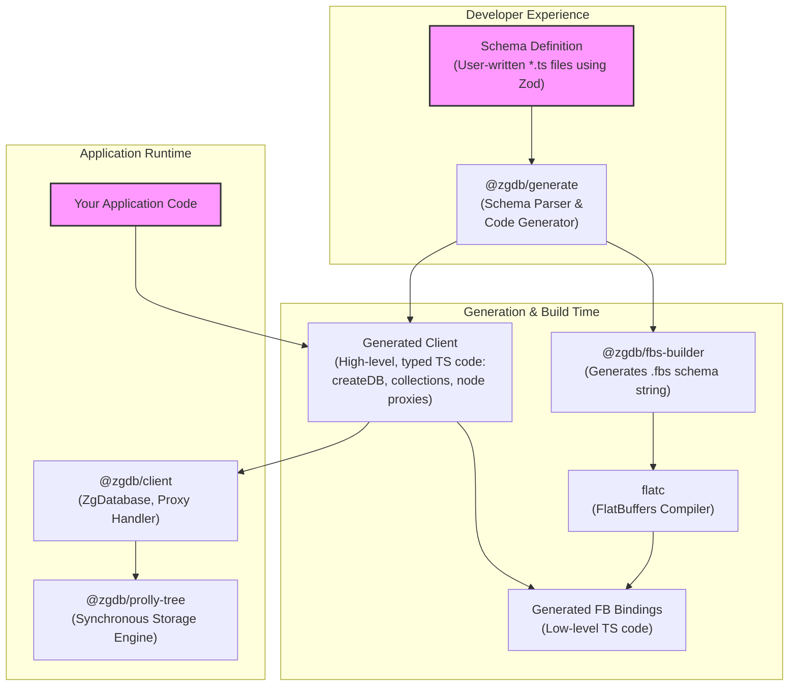

# ZG: A Schema-Driven Synchronous Database Toolkit

ZG is a next-generation database toolkit designed for modern, decentralized applications. It empowers developers to build real-time, collaborative, and offline-first applications with the safety and productivity of a strongly-typed, schema-driven workflow.

At its core, ZG provides a seamless developer experience by generating a fully-typed, synchronous client API from a simple schema definition. This abstracts away the complexities of high-performance serialization, storage, and data synchronization.

See our detailed [**MISSION.md**](./MISSION.md) for a deeper dive into the philosophy and architecture of the project.

## Core Concepts

- **Schema-First Development:** Define your data models, relationships, and business logic in plain TypeScript using `zod` and a simple `EntityDef` object. This is the single source of truth for your database.
- **Zero-Effort Code Generation:** Run the build command, and ZG automatically generates a high-performance Flatbuffers schema and a fully-typed TypeScript client tailored to your schema.
- **Synchronous API & Live Objects:** The generated client provides a fully synchronous API. It feels like interacting with simple in-memory objects, keeping your UI and business logic clean. When you access a node, you get a "live" proxy:
  - Reading a property is a zero-copy read: `console.log(post.title)`
  - Assigning a property is a synchronous write: `post.title = 'New Title'`
  - Traversing a relationship is a synchronous property access: `const author = post.author`
- **High-Performance Backend:** Under the hood, ZG uses Flatbuffers for efficient, zero-copy serialization and Deserialization, ensuring minimal latency.

## Architecture

ZG is a monorepo containing a suite of packages that work together to provide a seamless schema-to-query experience. The data flows from your high-level definition down to the low-level storage engine.



### Component Breakdown

- **Schema Definition:** You, the developer, define your entities in plain TypeScript files. You use the `zod` library to define the fields, which provides excellent validation and type inference.
- **`@zgdb/generate`:** This is the core engine of the toolkit. It finds and parses your schema files, validates the entity definitions, and orchestrates the entire code generation process.
- **`@zgdb/fbs-builder`:** A low-level helper library used by the generator to programmatically construct a FlatBuffers schema (`.fbs` file definition) from your TypeScript entity definitions.
- **`flatc`:** The official FlatBuffers compiler. The generator invokes this tool under the hood to compile the `.fbs` schema into low-level TypeScript code for serialization and deserialization.
- **Generated Client:** This is the primary output of the build process. It's a set of TypeScript files tailored to your schema, providing the high-level, type-safe API you'll use in your application (e.g., `createDB`, `db.posts`, etc.).
- **`@zgdb/client`:** The runtime engine. The generated client depends on this package. It contains the `ZgDatabase` class that manages the storage engine and powers the "live" proxy objects.
- **`@zgdb/prolly-tree`:** The underlying storage engine. It's a Probabilistic B-Tree (or Prolly Tree) with a fully synchronous API, chosen for its efficient, content-addressed structure.

## Getting Started

Follow these steps to get a local example of ZG up and running.

### 1. Prerequisites

You will need the following software installed on your machine:

- [Node.js](https://nodejs.org/) (v18 or higher)
- [pnpm](https://pnpm.io/installation)
- The **FlatBuffers Compiler (`flatc`)**. This is a critical dependency for generating the database serialization code.

<details>
<summary><b>➡️ How to install `flatc`</b></summary>
<br/>
The recommended way to install `flatc` is with a package manager for your OS.

**macOS (using Homebrew):**

```sh
brew install flatbuffers
```

**Debian/Ubuntu:**

```sh
sudo apt-get install flatbuffers-compiler
```

**Windows (using Winget):**

```sh
winget install Google.Flatbuffers
```

**From Source (if a package is not available):**
If your OS doesn't have a pre-built package, you can build it from source. This requires `git` and `cmake`.

```sh
# 1. Clone the official repository
git clone https://github.com/google/flatbuffers.git
cd flatbuffers

# 2. Build using CMake
cmake -G "Unix Makefiles"
make

# 3. Install the compiler system-wide
sudo make install

# 4. Verify the installation
flatc --version
```

</details>

### 2. Installation & Setup

Clone the repository and install the dependencies.

```sh
git clone <repo-url>
cd <repo-name>
pnpm install
```

### 3. Schema Definition In-Depth

The schema is the heart of your project. You define entities as an array of `EntityDef` objects. You can see a complete example in `packages/zg-playground/src/schema/`.

An `EntityDef` object has the following structure:

- `name: string`: The singular, capitalized name of the entity (e.g., `"Post"`). This will be used to generate collection names (e.g., `db.posts`).
- `schema: ZodObject`: A `zod` object defining the data fields for the entity. **The `id` field is mandatory for all entities.**
- `relationships: object`: An optional object defining relationships to other entities.
- `indexes: array`: An optional array of index definitions for optimizing queries.

#### **Fields (`schema`)**

You use `zod` to define your fields. The generator supports the following `zod` types:

| Zod Schema         | FlatBuffers Type | Notes                               |
| ------------------ | ---------------- | ----------------------------------- |
| `z.string()`       | `string`         |                                     |
| `z.number().int()` | `int32`          | For 32-bit signed integers.         |
| `z.bigint()`       | `int64`          | For 64-bit signed integers.         |
| `z.number()`       | `float64`        | For double-precision floating nums. |
| `z.boolean()`      | `bool`           |                                     |
| `.optional()`      | -                | Makes the field optional.           |
| `.describe("...")` | -                | Adds a comment to the schema.       |

**Example:**

```typescript
import { z } from "zod";

const PostSchema = z.object({
  id: z.string().describe("The unique ID of the post."),
  title: z.string(),
  content: z.string().optional(),
  viewCount: z.number().int(),
  publishedAt: z.bigint(),
  isPublished: z.boolean(),
});
```

#### **Relationships**

Relationships define how your entities connect to each other.

- **`"one"` Relationships (Foreign Key):** This is the most common relationship type. It signifies that this entity holds a foreign key to another entity.

  - `entity`: The name of the entity being referenced.
  - `cardinality`: `"one"`.
  - `field`: The name of the field in this entity's `schema` that holds the foreign key (e.g., `authorId`).

- **`"many"` Relationships (Reverse Lookup):** This defines the other side of a `"one"` relationship. It signifies that another entity holds a foreign key pointing back to this one.
  - `entity`: The name of the entity on the other side of the relationship.
  - `cardinality`: `"many"`.
  - `mappedBy`: The name of the relationship on the _other_ entity.

**Example: A User has many Posts, a Post has one Author**

```typescript
// In UserDef
relationships: {
  posts: {
    entity: "Post",
    cardinality: "many",
    mappedBy: "author", // <-- Points to the 'author' relationship in PostDef
  },
},

// In PostDef
relationships: {
  author: {
    entity: "User",
    cardinality: "one",
    field: "authorId", // <-- The foreign key field in PostDef's schema
  },
},
```

### 4. Build the Database Client

Run the build command from the root of the project. This will parse your schema and generate the database client.

```sh
pnpm build
```

This command triggers a process that finds your schema, validates it, and generates all the necessary files into the `src/schema/__generated__/` directory within the corresponding package (e.g., `packages/zg-playground/src/schema/__generated__/`).

### 5. Generated Client API Reference

The build process generates a `createDB` function. This is your main entry point.

```typescript
import { createDB } from "./schema/__generated__/createDB";

const db = createDB({
  // Optional config for resolvers
});
```

The `db` object is the main interface to your database. It has a property for each entity collection (e.g., `db.users`, `db.posts`).

#### **Collection API (`db.posts`)**

- `create(data)`: Creates a new entity. The `data` object must match the `zod` schema, including the `id`. Returns a "live" proxy to the new record.
  ```typescript
  const newUser = db.users.create({
    id: "user-123",
    displayName: "Alice",
    // ... other fields
  });
  ```
- `get(id)`: Finds an entity by its primary key. Returns a "live" proxy or `null`.
  ```typescript
  const foundPost = db.posts.get("post-abc");
  ```
- `[Symbol.iterator]()`: Collections are iterable, allowing you to scan all records.
  ```typescript
  for (const user of db.users) {
    console.log(user.displayName);
  }
  ```

#### **Node Proxy API (`post`)**

When you `get` or `create` a record, you receive a "live" node proxy.

- **Reading Fields:** Access properties directly. This is a zero-copy read from the underlying buffer.
  ```typescript
  console.log(post.title);
  ```
- **Updating Fields:** Assign a new value to a property. This is a synchronous write to the database.
  ```typescript
  post.title = "A New Title";
  ```
- **Accessing Relationships:** Access the relationship property directly. This is a synchronous operation that looks up the related node(s).
  ```typescript
  const author = post.author; // Returns a User proxy or null
  const posts = author.posts; // Returns an array of Post proxies
  ```

### Advanced Concepts: Resolvers

Resolvers are functions that create "computed" properties on your nodes. They can be defined globally or on a per-entity basis. This is useful for business logic, authorization checks, or creating dynamic fields.

**Example: Adding an `excerpt` to Posts and a global `isOwner` check.**

```typescript
const db = createDB({
  // Global resolvers are available on all nodes
  globalResolvers: {
    isOwner: (ctx: { actor: { id: string }; node: any }) => {
      // 'actor' is provided via db.with()
      return ctx.actor?.id === ctx.node.authorId;
    },
  },
  // Entity resolvers are specific to an entity type
  entityResolvers: {
    Post: {
      excerpt: (ctx: { node: { content: string } }) => {
        return ctx.node.content?.substring(0, 50) ?? "";
      },
    },
  },
});

const clientForUserA = db.with({ id: "user-A" });
const post = clientForUserA.posts.get("post-1");

// Now you can access these as if they were real fields:
console.log(post.excerpt);
console.log(post.isOwner); // true or false
```

## Monorepo Overview

This project is a monorepo managed by pnpm and Turbo. The key packages are:

- `packages/zg`: The home of the `@zgdb/generate` package, the core schema parser and code generator pipeline.
- `packages/client`: The core (non-generated) runtime client (`@zgdb/client`) that provides the `ZgDatabase` and manages the live object proxies.
- `packages/fbs-builder`: A helper library for programmatically building Flatbuffer schemas.
- `packages/prolly-tree`: The underlying storage engine, a Probabilistic B-Tree with a synchronous API.
- `packages/zg-playground`: An example package that demonstrates how to define a schema and use the generated client.
